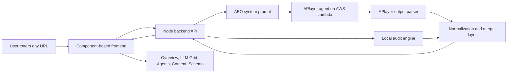

# AEO Vision

Agentic Answer Engine Optimization for any URL.

[AEO Vision](https://aeo-vision.vercel.app) is a full-stack AEO dashboard that analyzes how AI answer engines understand, cite, and recommend a website. It combines a professional component-based frontend, a Node backend, a deterministic local audit engine, and a live APlayer agent hosted behind an AWS Lambda function URL.

The product is built for founders, marketers, SEO teams, growth teams, content strategists, and product teams who need to understand a new search reality: people are no longer only clicking blue links. They are asking ChatGPT, Claude, Gemini, Perplexity, Copilot, Grok, Meta AI, You.com, and other answer engines what to trust.

## The Problem

Traditional SEO tools are built around search result rankings, keywords, backlinks, and page metadata. Those signals still matter, but they do not fully answer the new question:

> When an AI system reads this website, can it understand the brand, trust the claims, quote the page, and recommend it as the answer?

Many websites look polished to humans but fail in AI answer engines because:

- The entity is unclear: the page does not plainly say what the brand is, who it serves, and what category it belongs to.
- Claims are not citation-ready: models cannot find dated, verifiable, source-backed proof.
- The content is not answer-ready: there is no concise paragraph an LLM can safely reuse.
- Schema is thin or missing: crawlers do not get a machine-readable trust layer.
- Critical text is hard to extract: important information may be hidden behind heavy scripts, visual layouts, or vague copy.
- Different LLMs interpret the same URL differently, and teams usually cannot see where each model is confident or fragile.

AEO Vision solves this by turning one URL into a structured, agentic AEO audit and a practical improvement plan.

## What AEO Vision Does

AEO Vision audits any URL and answers five core questions:

1. How ready is this page for AI-generated answers?
2. Which answer engines are likely to quote, mention, or skip it?
3. What entity, proof, schema, content, and crawler gaps are holding it back?
4. What should the team improve first for the highest lift?
5. What answer-ready copy and JSON-LD should be shipped next?

The dashboard returns:

- AEO readiness score.
- Answer ownership score.
- Projected improvement lift.
- Trust, clarity, citation, schema, and crawlability scores.
- LLM-by-LLM interpretation mapping.
- Prompt probes that simulate buyer and researcher questions.
- Agentic workstreams for entity, citation, schema, content, and crawler improvements.
- Answer-ready content blocks.
- JSON-LD schema recommendations.
- A report-ready output for sharing audit results.

## Why This Matters

Search is becoming conversational. A buyer may ask an AI assistant:

- "What is this company?"
- "Is this tool reliable?"
- "Who is this product for?"
- "What are the best options for this problem?"
- "Can I trust this source?"

If the website does not provide clear, verifiable, machine-readable answers, the model may skip it or rely on secondary sources. AEO Vision helps teams make their websites easier for answer engines to understand, trust, cite, and repeat.

## Agentic Architecture

The live agent is deployed as an AWS Lambda function and exposed through an APlayer `send_message` endpoint. The backend integrates with that Lambda-hosted agent through environment variables, so credentials stay on the server and are never exposed in browser code.

The agent is orchestrated as a specialist AEO team:

- Entity Agent: resolves brand identity, category, audience, canonical facts, and ambiguity risks.
- Citation Agent: checks whether claims are source-backed, dated, quotable, and credible.
- Schema Agent: recommends Organization, WebPage, FAQPage, BreadcrumbList, Product, Article, sameAs, and speakable markup where relevant.
- Content Agent: creates direct-answer blocks, entity clarity copy, proof snippets, and comparison language.
- Crawler Agent: identifies retrieval friction from rendering, heavy scripts, robots rules, navigation, and missing plain-text signals.

The Node backend builds a deterministic local baseline first, then sends the URL, baseline, and AEO system prompt to the Lambda agent. The agent response is parsed from the APlayer envelope at `output.payload.content`, normalized, merged with the local audit shape, and returned to the frontend as one stable dashboard object.

If the Lambda agent is unavailable, slow, malformed, or returns plain text instead of structured JSON, the app safely falls back to the local audit engine. The dashboard remains usable, and the response is labeled so the user knows whether the result came from the external agent or local simulation.

## High-Level Flow



## Application Tabs

### Overview

The Overview tab gives the executive readout for the URL.

It includes:

- AEO readiness score.
- Answer ownership percentage.
- Projected improvement velocity.
- Executive diagnosis from the agent.
- Model interpretation constellation showing where the URL is understood, quoted, or skipped.
- Autonomous agent queue with progress indicators.
- Prioritized opportunity cards sorted by impact, speed, or trust.

This tab is designed for quick decision-making. A user should be able to see the current AEO health of a page and immediately understand what needs attention.

### LLM Grid

The LLM Grid shows how different answer engines may interpret the same URL.

It includes:

- Model cards for ChatGPT, Claude, Gemini, Perplexity, Copilot, Grok, Meta AI, and You.com.
- Per-model score, status, and explanation.
- Heat cells showing signal strength across probe dimensions.
- Prompt probes that test whether the URL owns, partially appears in, or misses important answers.

This tab helps teams understand that AEO is not one generic score. A page can be strong in one model and fragile in another.

### Agents

The Agents tab shows the orchestration layer.

It includes:

- Entity workflow.
- Citation workflow.
- Schema workflow.
- Content workflow.
- Crawler workflow.
- Per-agent tasks and cycle progress.

This tab explains how the system turns diagnosis into execution. Instead of saying "improve SEO", it breaks the work into concrete agent tasks that a team can ship.

### Content

The Content tab generates answer-ready language from the audit.

It includes:

- Direct answer block: a concise paragraph that explains the brand or page in a form that answer engines can quote.
- Entity clarity paragraph: language that disambiguates what the brand is, what category it belongs to, and who it serves.
- Comparative proof snippet: a short proof-oriented block that helps models understand differentiation.

This tab is important because LLMs need clean, reusable language. If the page does not provide it, the model may summarize poorly or depend on third-party sources.

### Schema

The Schema tab provides the machine-readable trust layer.

It includes:

- JSON-LD output.
- Organization, WebPage, FAQ, Breadcrumb, and related schema guidance.
- Entity graph checks.
- Speakable selector recommendations.
- sameAs coverage guidance.
- FAQ intent alignment.
- Copy-to-clipboard support for schema output.

This tab helps developers and SEO teams translate AEO recommendations into structured data that crawlers and answer engines can interpret.

## Backend API

### `GET /api/health`

Returns server health and whether the live APlayer agent is configured.

### `POST /api/audit`

Runs the AEO audit for a URL.

Example request:

```json
{
  "url": "https://www.loops.house/",
  "routeVariant": 0,
  "workflowCycle": 0,
  "copyVariant": 0
}
```

Example response shape:

```json
{
  "audit": {
    "analysisProvider": "external-agent",
    "agentResponseKind": "structured-json",
    "score": 71,
    "ownership": 72,
    "lift": 34,
    "dimensions": {
      "trust": 70,
      "clarity": 69,
      "citations": 73,
      "schema": 63,
      "crawl": 67
    },
    "models": [],
    "opportunities": [],
    "copy": {},
    "schema": {}
  }
}
```

### `POST /api/report`

Creates a compact report-ready summary from an audit object.

## Tech Stack

Frontend:

- HTML, CSS, and browser-native JavaScript ES modules.
- Component-based UI without a framework dependency.
- Canvas visualizations for score gauge and model constellation.
- Fetch-based service layer for backend API calls.
- Professional dashboard layout with responsive loading states.

Backend:

- Node.js native HTTP server for local development.
- Vercel serverless functions for production API routes.
- Native `fetch` for Lambda agent communication.
- Local deterministic audit engine for fallback analysis.
- APlayer envelope parser and structured merge layer.

Agent:

- APlayer agent hosted behind an AWS Lambda function URL.
- AEO system prompt sent through the user-message payload for compatibility.
- Specialist-agent reasoning model: Entity, Citation, Schema, Content, and Crawler.
- JSON-first output contract with safe parsing and fallback behavior.

Deployment:

- Vercel frontend and serverless API deployment.
- GitHub connected deployment workflow.
- Runtime secrets configured as Vercel environment variables.

## Folder Structure

```text
AI-AEO/
  api/
    audit.js
    health.js
    report.js
    _utils.js
  backend/
    server.js
    lib/
      agentClient.js
      auditEngine.js
      systemPrompt.js
  frontend/
    index.html
    assets/
    styles/
    src/
      components/
      services/
      state/
      utils/
  docs/
    ARCHITECTURE.md
  scripts/
    build-static.mjs
    test-agent-scenarios.mjs
```

## Local Setup

Install dependencies:

```bash
npm install
```

Run the local app:

```bash
npm run dev
```

Open:

```text
http://127.0.0.1:8787
```

Run syntax checks:

```bash
npm run check
```

Build the static frontend:

```bash
npm run build
```

## Live Agent Configuration

Create a local `.env` file for live Lambda-agent analysis:

```bash
APLAYER_AGENT_URL=https://your-lambda-function-url/agent/APlayer/send_message
APLAYER_AUTHENTICATION=api-key your-real-key
APLAYER_USER_ID=your.email@example.com
APLAYER_TIMEOUT_MS=55000
```

Notes:

- Keep credentials in `.env` locally and Vercel environment variables in production.
- Do not expose APlayer credentials in frontend code.
- The backend calls the Lambda agent on behalf of the browser.
- If `APLAYER_AUTHENTICATION` is not supplied, the backend can format `APLAYER_API_KEY` as `api-key ...`.
- Timeout is clamped to a safe range so the dashboard does not hang indefinitely.

## Vercel Deployment

This project is ready for Vercel.

Required production environment variables:

```text
APLAYER_AGENT_URL
APLAYER_AUTHENTICATION
APLAYER_USER_ID
APLAYER_TIMEOUT_MS
```

Recommended deployment flow:

```bash
npm run check
npm run build
npx vercel@latest deploy --prod
```

Production URL:

[https://aeo-vision.vercel.app](https://aeo-vision.vercel.app)

## Agent Scenario Testing

Run:

```bash
npm run test:agent
```

The scenario tester validates different agent paths, including:

- Structured JSON responses.
- Content-only responses.
- Timeout or unavailable agent fallback.
- Multiple URL categories.
- Local engine continuity when the external Lambda cannot be reached.

## What Makes This Project Different

AEO Vision is not a generic SEO score page. It is an agentic workflow for AI-era discoverability.

It brings together:

- Live external agent reasoning.
- Local fallback analysis.
- LLM-specific visibility mapping.
- Agent workstream orchestration.
- Answer-ready content generation.
- Schema and citation recommendations.
- Production-ready backend integration with secure environment configuration.

The result is a practical system for improving how AI answer engines understand and recommend a URL.

## Documentation

See [docs/ARCHITECTURE.md](docs/ARCHITECTURE.md) for the architecture, build approach, tech stack, and challenges encountered while building the app.

## License

This project is licensed under the MIT License. See [LICENSE](LICENSE).
