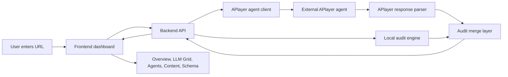

# AEO Vision Architecture

## Product Goal

AEO Vision is an agentic AEO command center. The user enters any URL, and the app evaluates how well that URL can be understood, cited, and recommended by answer engines such as ChatGPT, Claude, Gemini, Perplexity, Copilot, Grok, Meta AI, and You.com.

The dashboard is designed to answer four questions:

1. How visible is this URL to AI answer engines?
2. Which LLMs are likely to quote, mention, or skip it?
3. What should AI improve first for stronger AEO?
4. What schema, copy, citations, and crawler changes should be shipped?

## High-Level Architecture



## Folder Structure

```text
AI-AEO/
  backend/
    server.js
    lib/
      agentClient.js
      auditEngine.js
      systemPrompt.js
  frontend/
    index.html
    styles/main.css
    src/
      main.js
      components/
      services/
      state/
      utils/
  docs/
    ARCHITECTURE.md
  .gitignore
  LICENSE
  package.json
```

## Tech Stack

Frontend:

- HTML, CSS, and browser-native JavaScript ES modules.
- Component-based rendering without a framework dependency.
- Canvas for score gauge and LLM constellation visualization.
- Fetch API for backend communication.

Backend:

- Node.js native HTTP server.
- No runtime framework dependency.
- Native `fetch` for the external APlayer agent call.
- Environment-based configuration through `.env`.

Agent and analysis:

- Local deterministic audit engine for fast fallback analysis.
- Optional APlayer Lambda agent integration.
- Dedicated system prompt for agentic AEO analysis.
- Response parser for the APlayer envelope: `output.payload.content`.
- Merge layer that normalizes live agent JSON into the dashboard shape.

Security and configuration:

- Secrets are not committed.
- `.env` is ignored by git.
- Required live-agent settings are documented in `README.md`.
- API keys are read from `APLAYER_AUTHENTICATION` or `APLAYER_API_KEY`.

## Runtime Flow

1. The frontend loads from the backend at `http://127.0.0.1:8787`.
2. `frontend/src/main.js` requests `/api/audit`.
3. `backend/server.js` creates a baseline audit using `auditEngine.js`.
4. If APlayer credentials exist, `agentClient.js` sends the URL, baseline, and AEO system prompt to the external agent.
5. The agent response is read from `output.payload.content`.
6. If the content contains valid or repairable JSON, the backend merges it as a structured live-agent audit.
7. If the response is plain text, slow, malformed, or unavailable, the backend uses the local audit engine and preserves the agent note when useful.
8. The frontend renders the dashboard views from one normalized audit object.

## API Endpoints

`GET /api/health`

Returns backend health plus whether the live agent is configured.

`POST /api/audit`

Request:

```json
{
  "url": "openai.com/business",
  "routeVariant": 0,
  "workflowCycle": 0,
  "copyVariant": 0
}
```

Response:

```json
{
  "audit": {
    "analysisProvider": "external-agent",
    "agentResponseKind": "structured-json",
    "score": 82,
    "models": [],
    "opportunities": [],
    "copy": {},
    "schema": {}
  }
}
```

`POST /api/report`

Returns a compact export-ready report from either a supplied audit or a generated one.

## Frontend Components

The frontend is split by dashboard responsibility:

- `App.js`: app shell composition.
- `Sidebar.js`: navigation.
- `Topbar.js`: title and actions.
- `AuditConsole.js`: URL input and provider status.
- `OverviewPanel.js`: score cards, agent queue, opportunities, and constellation canvas.
- `LlmPanel.js`: model matrix and prompt probes.
- `AgentsPanel.js`: agent workflow.
- `ContentPanel.js`: generated AEO copy.
- `SchemaPanel.js`: JSON-LD and trust-layer checks.

Supporting modules:

- `services/api.js`: backend requests.
- `state/store.js`: lightweight shared app state.
- `utils/charts.js`: canvas rendering.
- `utils/html.js`: HTML escaping for dynamic content.

## How We Built It

1. Started with a polished static dashboard prototype to validate the UX direction.
2. Split the project into `frontend/` and `backend/`.
3. Moved the audit logic out of the browser and into `backend/lib/auditEngine.js`.
4. Rebuilt the frontend as ES-module components.
5. Connected the frontend to the backend through `/api/audit` and `/api/report`.
6. Added an external APlayer agent client and a dedicated AEO system prompt.
7. Added an APlayer response parser for the real envelope shape.
8. Added safe fallback behavior so the dashboard remains usable when the external agent is slow or unavailable.
9. Added docs, `.gitignore`, MIT license, and environment template.

## Main Challenges

External agent response shape:

The APlayer response does not return the answer at the top level. The useful content lives at `output.payload.content`, so the parser had to prioritize that path.

Malformed JSON inside agent content:

The live agent can return JSON-like text with common issues such as doubled quotes inside string values. We added a repair pass for common cases before parsing.

Structured versus content-only responses:

Sometimes the agent returns a normal assistant message rather than structured AEO JSON. The backend now labels those as `content-only` and uses the local engine for scoring.

Slow or unavailable agent calls:

The external Lambda can time out. The backend uses `APLAYER_TIMEOUT_MS` and falls back to the local engine instead of blocking the dashboard indefinitely.

Secret handling:

The user provided a key in a curl example, but the project should not commit secrets. We kept credentials in `.env`, documented the required keys in `README.md`, and left `.env` ignored.

Local server sandboxing:

The Node server needed permission to bind to localhost. We scoped the server to `127.0.0.1` and used `npm run dev`.

Dashboard shape stability:

The frontend expects a complete audit object. The merge layer ensures every response still contains scores, models, probes, copy, opportunities, schema, and workflow data.

## Current Status

- Backend runs at `http://127.0.0.1:8787`.
- Frontend is served by the backend.
- Live agent analysis is supported when credentials are configured.
- Local fallback is always available.
- Browser verification passed with 8 LLM cards and no console errors.
